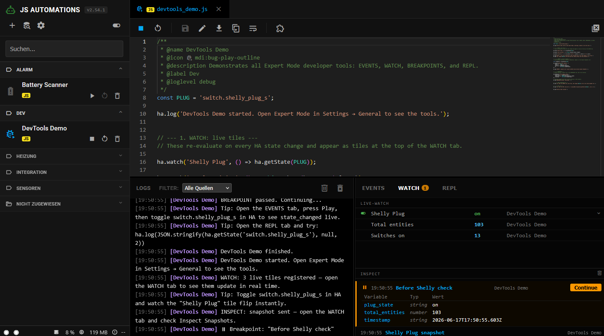

# ⚡ JS Automations for Home Assistant


<p align="center">
  
</p>

**JS Automations** is a professional-grade JavaScript execution engine for Home Assistant. It allows you to write automations using standard **Node.js** in a secure, isolated environment. With its integrated Web IDE and powerful API, it brings a developer-centric workflow to your smart home.

> 📘 **Deep Dive:** Interested in the internal architecture? Check out the [Technical Documentation](docs/TECH-README.md) or the [Project Roadmap](docs/ROADMAP.md).

## Key Features

*   **Thread Isolation:** Each script runs in its own Worker Thread. Crashes are contained and won't affect HA.
*   **Unified Creation Wizard:** Easily create new scripts from templates, upload files, or import code from GitHub/Gist.
*   **Smart Triggers:** ioBroker-inspired `ha.on()` logic supporting Wildcards, Arrays, and Regular Expressions.
*   **Sync State Cache:** Read any Home Assistant state instantly via `ha.states` without async overhead.
*   **Persistent Store:** Share variables between scripts or survive reboots with the synchronous `ha.store`.
*   **Store Explorer:** Visual interface to view, edit, and delete global variables in `ha.store` (supports **Secrets**).
*   **Global Libraries:** Create reusable code modules and include them in any script using the `@include` tag.
*   **Automatic NPM:** Packages defined in the header are automatically installed in a persistent hidden directory.
*   **Managed Lifecycle:** Scripts stop automatically when finished unless they have active listeners (Cron/Events).
*   **Smart Organization:** Scripts are automatically grouped by their `@label`. The sidebar headers inherit the **icon and color** directly from your Home Assistant Label Registry and are collapsible for a better overview.

---

## Local Development Setup

1.  **Clone the repository** and navigate into the directory.
2.  **Install dependencies:**
    ```bash
    npm install
    ```
3.  **Start the server:**
    ```bash
    npm run dev
    ```
4.  **Follow the setup wizard:** On the first run, a wizard will automatically start in your terminal. It will ask for your Home Assistant URL and a Long-Lived Access Token.
5.  **Done!** The wizard creates a `.env` file for you, and the server will start. The UI is available at `http://localhost:PORT`.

---

## Unified Creation Wizard

The **+** button opens the new creation wizard, offering three ways to add scripts:
1.  **New:** Start from scratch or select a template (e.g., Interval, State Trigger).
2.  **Upload:** Drag & drop `.js` files directly into the editor.
3.  **Import:** Paste a raw URL (GitHub/Gist) to fetch code from the web.

---

## Switches & Control

> **Note:** This feature is under active development. The goal is to allow scripts to be exposed as a `switch` or `button` via a header tag. The current implementation creates a switch for every script, which may not be ideal for all use cases.

For every automation script you create, the addon automatically generates a matching `switch` entity in Home Assistant. This allows you to monitor and control your scripts directly from your dashboard.
*   **Entity ID:** `switch.js_automation_<script_name>`
*   **State:** The switch is `on` when the script is running and `off` when it's stopped.
*   **Control:** Toggling the switch in Home Assistant will start or stop the script. This is perfect for manually triggering automations or stopping long-running tasks.
*   **Custom Icon:** The switch will automatically use the icon you define in the script's `@icon` metadata tag.

```javascript
/**
 * @name My Awesome Script
 * @icon mdi:robot-happy
 */

// This script will have a switch named "switch.js_automation_my_awesome_script"
// with the "mdi:robot-happy" icon.
```

---

## The Metadata Header

Every script starts with a JSDoc-style header. This configures the engine's behavior.

```javascript
/**
 * @name Battery Monitor
 * @icon mdi:battery-alert
 * @description Checks all battery levels daily
 * @loglevel info
 * @npm lodash
 * @include telegram_helper.js
 * @area Technical Room
 * @label Maintenance
 */
```
---

### Log Manager

All script outputs are captured by the central **Log Manager**.
*   **Live Stream:** View logs in real-time in the dashboard IDE.
*   **History:** Access past logs via the "Logs" tab in the UI.
*   **Levels:** Filter by `info`, `warn`, `error`, or `debug` (configurable per script via `@loglevel`).

---

## Store Explorer

The **Store Explorer** provides a graphical user interface for the `ha.store`.
*   **Visual Management:** View all global variables in a sortable table.
*   **Live Updates:** See values, owners, and last update timestamps.
*   **Edit & Delete:** Modify values directly or remove obsolete keys.
*   **Search:** Filter keys and values to find specific data quickly.
*   **Secrets Management:** Mark variables as "Secret" to mask their values in the UI (e.g., `••••••••`). This is perfect for storing API keys, tokens, or passwords that your scripts need but shouldn't be visible on screen.

## Expert Mode

> **Note:** Currently, Expert Mode is **permanently enabled** for all users. It might become a configurable option in a future release.

*   **Store Explorer:** Access the global variable database via the header button.
*   **Clear Server Logs:** Button to permanently delete the entire server-side log history.

---

## Global Libraries

Stop copying and pasting code! With Global Libraries, you can write functions once and use them everywhere.

### 1. Creating a Library
When creating a new script, select **Global Library** as the type.
*   Libraries are saved in a dedicated `libraries/` subfolder.
*   They are **passive**: They do not have a Start/Stop button and do not run on their own.
*   They can define their own `@npm` dependencies.

### 2. Using a Library
To use a library in your automation, simply add the `@include` tag to your header:

```javascript
/**
 * @name Living Room Lights
 * @include utils.js, lighting_scenes.js
 */

// Now you can use functions defined in utils.js
const isDark = utils.isDarkOutside();
```

### 3. IntelliSense
The integrated editor is smart enough to read your libraries. When you type a function name from an included library, you will get **autocomplete** and parameter hints, just like with built-in functions.

---

## API Documentation

### 1. Logging & Debugging
Control visibility via the `@loglevel` header (debug, info, warn, error).

```javascript
ha.debug("Variable x is: " + x); // Only visible if @loglevel is debug
ha.log("Automation started");    // Standard white log
ha.warn("Battery is low!");      // Yellow log
ha.error("API failed!");         // Red log (marks script as crashed)
```

### 2. Reactive Triggers (`ha.on`)
React to changes in Home Assistant. **Using this keeps your script running.**

```javascript
// --- Single Entity ---
ha.on('binary_sensor.front_door', (e) => {
    ha.log(`Door is now ${e.state}`); // e.state is 'on' or 'off'
});

// --- Wildcards (Match multiple) ---
ha.on('light.living_room_*', (e) => {
    ha.log(`${e.attributes.friendly_name} changed to ${e.state}`);
});

// --- Regular Expressions (Advanced) ---
ha.on(/^sensor\..*_humidity$/, (e) => {
    ha.log(`${e.entity_id} reports ${e.state}% humidity`);
});

// --- Arrays ---
ha.on(['input_boolean.test', 'switch.garden'], (e) => {
    ha.log("One of the tracked entities changed");
});
```

### 3. Reading States (`ha.states`)
The cache is updated in real-time. No `await` required.

```javascript
const temp = ha.states['sensor.outdoor_temp'].state;
const name = ha.states['sensor.outdoor_temp'].attributes.friendly_name;

if (parseFloat(temp) > 25) {
    ha.log(`It is hot in ${name}`);
}
```

### 4. Setting States & Creating Sensors (`ha.updateState`)
Create virtual sensors or update existing ones directly in HA.

```javascript
// This creates 'sensor.js_energy_total' if it doesn't exist
ha.updateState('sensor.js_energy_total', 1250.5, {
    unit_of_measurement: 'kWh',
    friendly_name: 'Total Calculated Energy',
    icon: 'mdi:transmission-tower'
});
```

### 5. Calling Services (`ha.callService`)
Trigger any action in Home Assistant.

```javascript
// Turn on a light with attributes
ha.callService('light', 'turn_on', {
    entity_id: 'light.kitchen',
    brightness: 150,
    rgb_color: [255, 0, 0]
});

// Send a notification
ha.callService('notify', 'mobile_app_phone', {
    title: 'Security Alert',
    message: 'Motion detected in the garage!'
});
```

### 6. Entity Selectors (`ha.select`)
Perform bulk actions on groups of entities.

```javascript
// Turn off all lights in a specific area
ha.select('light.*')
  .where(l => l.attributes.area === 'Living Room')
  .turnOff();

// Find all sensors with low battery
const lowBatteries = ha.select('sensor.*_battery_level')
  .where(s => parseFloat(s.state) < 10)
  .toArray();

ha.log(`Found ${lowBatteries.length} sensors with low battery.`);
```

### 7. Persistent Store (`ha.store`)
Share data across scripts or reboots. Synchronous read/write.

```javascript
// Set a value
ha.store.set('guest_mode', true);

// Read a value (synchronous)
if (ha.store.val.guest_mode === true) {
    ha.log("Guest mode is active");
}

// Delete a value
ha.store.delete('temp_variable');
```

---

## Global Built-ins

No need to `require` these, they are always available.

### `axios`
Standard library for HTTP requests.
```javascript
async function checkWeather() {
    const res = await axios.get('https://api.weather.com/v1/...');
    ha.log("Temp: " + res.data.temp);
}
```

### `schedule(cron, callback)`
Time-based execution using CRON syntax. **Keeps script running.**
```javascript
// Every day at 07:30
schedule('30 7 * * *', () => {
    ha.log("Time to wake up!");
});
```

### `sleep(ms)`
Pause execution in async functions.
```javascript
async function sequence() {
    ha.callService('light', 'turn_on', { entity_id: 'light.test' });
    await sleep(2000); // wait 2 seconds
    ha.callService('light', 'turn_off', { entity_id: 'light.test' });
}
```

---
## Internationalization

The user interface is available in both German and English.
- **Automatic Detection:** The language is automatically chosen based on your browser's settings.
- **Manual Override:** You can force a specific language for testing by adding the `?lng=` query parameter to the URL. For example, `?lng=en` will switch the UI to English.

---

## Complete Examples

### Smart Bathroom Fan
Logic: Run fan if humidity is > 65% for 5 minutes, then stop.

```javascript
/**
 * @name Bathroom Fan Logic
 * @loglevel info
 */

let stopTimer = null;

ha.on('sensor.bathroom_humidity', (e) => {
    const hum = parseFloat(e.state);
    
    if (hum > 65) {
        ha.log("Humidity high! Starting fan.");
        ha.callService('switch', 'turn_on', { entity_id: 'switch.bathroom_fan' });
        
        // Cancel any pending stop timer
        if (stopTimer) clearTimeout(stopTimer);
    } 
    else if (hum < 55) {
        ha.log("Humidity normalized. Stopping fan in 5 minutes.");
        if (stopTimer) clearTimeout(stopTimer);
        
        stopTimer = setTimeout(() => {
            ha.callService('switch', 'turn_off', { entity_id: 'switch.bathroom_fan' });
            ha.log("Fan stopped.");
        }, 300000);
    }
});

// Cleanup timer if script is updated/stopped
ha.onStop(() => {
    if (stopTimer) clearTimeout(stopTimer);
});
```

### Trash Collection Monitor (`@npm` Example)
This script uses the `node-ical` package to check an online calendar for upcoming trash collections and creates a sensor in Home Assistant.

```javascript
/**
 * @name Trash Collection Calendar
 * @icon mdi:trash-can
 * @description Checks an iCal link for tomorrow's trash collection.
 * @npm node-ical
 * @loglevel info
 */

const ical = require('node-ical');
const CALENDAR_URL = "https://your-calendar-link.ics";

async function checkTrash() {
    try {
        const data = await ical.async.fromURL(CALENDAR_URL);
        const tomorrow = new Date();
        tomorrow.setDate(tomorrow.getDate() + 1);
        tomorrow.setHours(0,0,0,0);

        let trashType = "None";
        
        for (let k in data) {
            const event = data[k];
            if (event.type === 'VEVENT') {
                const eventDate = new Date(event.start);
                eventDate.setHours(0,0,0,0);

                if (eventDate.getTime() === tomorrow.getTime()) {
                    trashType = event.summary;
                    ha.log(`Collection tomorrow: ${trashType}`);
                    break;
                }
            }
        }

        ha.updateState('sensor.js_trash_tomorrow', trashType, {
            friendly_name: 'Trash Collection Tomorrow',
            icon: 'mdi:delete-alert'
        });

    } catch (e) {
        ha.error("Calendar check failed: " + e.message);
    }
}

// Check every day at 18:00 (6 PM)
schedule('0 18 * * *', checkTrash);

// Run once on startup
checkTrash();
```

### Intelligence with `ha.select` (Battery Guardian)
Instead of writing 50 separate automations, this script scans your entire home for low battery levels in a single sweep.

```javascript
/**
 * @name Battery Guardian
 * @icon mdi:battery-alert
 * @description Alerts if any battery level drops below 15%
 */

async function scanBatteries() {
    ha.log("Starting battery scan...");
    
    // Select all sensors ending with '_battery'
    const lowDevices = ha.select('sensor.*_battery')
        .where(s => {
            const val = parseFloat(s.state);
            return val < 15 && s.state !== 'unavailable' && s.state !== 'unknown';
        })
        .toArray();

    if (lowDevices.length > 0) {
        const names = lowDevices.map(s => s.attributes.friendly_name || s.entity_id).join(', ');
        ha.warn(`Low battery levels detected: ${names}`);
        
        // Send a persistent notification to the Home Assistant UI
        ha.callService('notify', 'persistent_notification', {
            title: 'Low Battery Alert',
            message: `The following devices need new batteries: ${names}`
        });
    } else {
        ha.log("All batteries are within the healthy range.");
    }
}

// Check every Sunday at 10:00 AM
schedule('0 10 * * 0', scanBatteries);

// Run once on startup
scanBatteries();
```