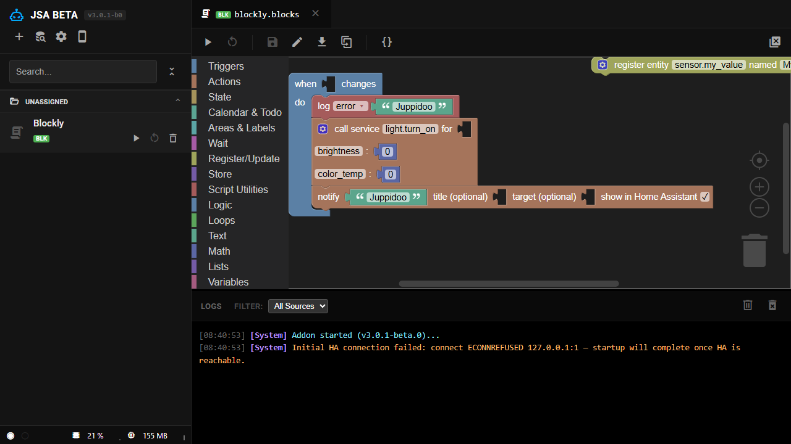

# Visual Scripting (Blockly)

Blockly lets you build an automation by dragging blocks instead of typing JavaScript — triggers, entity/service calls, MQTT, webhooks, calendar/todo access, loops and variables are all available as blocks. It's a second, parallel scripting pipeline: a `.blocks` file (a JSON-serialized block tree, not code) compiles down to the exact same kind of `.js` file a hand-written script produces, and runs in a Worker Thread the same way.

## Creating a Blockly script

Open the **+** creation wizard (see [Creation Wizard](./creation-wizard.md)) and pick the Blockly/visual option instead of JavaScript or TypeScript. This opens the block editor with an empty workspace and the block palette on the side.

  

## The block palette

Blocks are grouped into categories in the toolbox:

| Category                                   | Covers                                                                                        |
| ------------------------------------------ | --------------------------------------------------------------------------------------------- |
| Triggers                                   | `ha.on()` state-change triggers, `schedule()`                                                 |
| Actions                                    | `ha.call()` service calls                                                                     |
| State                                      | Reading state/attributes (`ha.getState`, `ha.getStateValue`, `ha.getAttr`, `ha.entityExists`) |
| Calendar & Todo                            | `ha.getCalendarEvents()`, `ha.getTodoItems()`                                                 |
| Areas & Labels                             | `ha.getAreas()`, `ha.getEntitiesInArea()`, `ha.getEntitiesWithLabel()`                        |
| Wait                                       | `ha.waitFor()` / `ha.waitUntil()`, `sleep()`                                                  |
| Register/Update                            | `ha.register()`, `ha.update()`                                                                |
| Store                                      | `ha.store` reads/writes                                                                       |
| Script Utilities                           | `ha.log/debug/warn/error()`, `ha.stop()`, `ha.notify()`                                       |
| Logic, Loops, Text, Math, Lists, Variables | Standard Blockly building blocks (unrelated to the `ha` API — control flow and data)          |

A fluent entity call like `ha.entity('light.living_room').turn_on({ brightness: 255 })` is deliberately **not** its own block — it would be redundant with the Actions category's service-call block (same underlying effect, just different JS syntax), so it was skipped to keep the palette focused.

## Show Code

A "Show Code" panel next to the workspace renders the JavaScript your blocks currently generate, live, as you edit — the same code-generation engine that produces the real runtime output, so what you see is what actually runs. This is also the escape hatch: once you outgrow the blocks, duplicate the script as a plain `.js` file and keep editing it as regular code from that point on.

## Where block errors point

If a running Blockly script throws, the error is traced back to the _specific block_ that caused it, not just "somewhere in this script" — click the error in the log and the offending block is highlighted directly in the editor. This works because the compiler wraps each block's generated statement in its own try/catch that tags the error with that block's id as it propagates up, so the innermost (most specific) block wins the attribution.

## Permissions

Free-form JS/TS scripts self-declare what they need via the `@permission` header tag. Blockly scripts don't need this — since every capability-using construct is one of JSA's own known block types, the required permissions are derived automatically from which blocks you actually used (e.g. dropping a webhook-trigger block onto the canvas adds the `webhook` permission by itself).

## Under the hood

For the compiler internals — how a `.blocks` file becomes `dist/<name>.js`, how permissions are derived and written back, and how block-level error tagging is implemented — see [TECH-README §15, Blockly: Visual Scripting Compilation](../TECH-README.md#15-blockly-visual-scripting-compilation).
