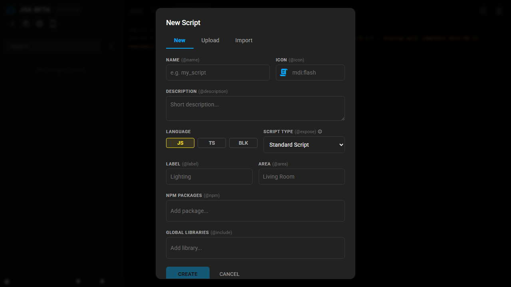

# Unified Creation Wizard

The **+** button in the sidebar opens the creation wizard — the single entry point for getting a new script into the add-on, in three modes:

1. **New** — start from a blank JavaScript, TypeScript, or Blockly file.
2. **Upload** — drag & drop existing `.js`/`.ts` files straight into the editor.
3. **Import** — paste a raw file URL (a GitHub file or Gist) and the wizard fetches the code for you.

  

Import is also how [Script Packs](./card-packs.md) are typically shared and installed: paste the URL, and the add-on handles NPM dependencies, TypeScript compilation, entity registration, and (if the file has a `__JSA_CARD__` block) card installation automatically — no manual setup steps.

> 💡 **Script Library:** browse and import ready-to-use scripts at [ha-jsa-library](https://rocklobster42195.github.io/ha-jsa-library/) — its "Add to JSA" button opens this same import wizard with the URL already filled in.

## What LABEL and AREA actually do

These two fields look symmetric in the form, but only one of them affects how the script shows up in the sidebar:

- **LABEL (`@label`)** groups scripts in the sidebar and, if a Home Assistant Label with the same name exists, **inherits that label's icon and color** for the group header — matched case-insensitively against the HA Label Registry. HA stores label colors as theme-color slugs (e.g. `light-green`), not CSS values, so the sidebar resolves them through the same palette Home Assistant's own frontend uses. No matching HA Label? The group still gets created, just with a plain folder icon and default color.
- **AREA (`@area`)** only assigns the area of the entity this script exposes/registers (via `ha.register()`/`@expose`) in Home Assistant, and is used as extra matched text in the sidebar's search box.

So for a labeled, color-coded group of related scripts, set a matching `@label` on each — `@area` is about where the *entity* lives in HA, not how the *script* is organized in the IDE.
